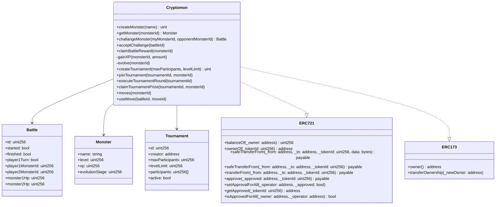
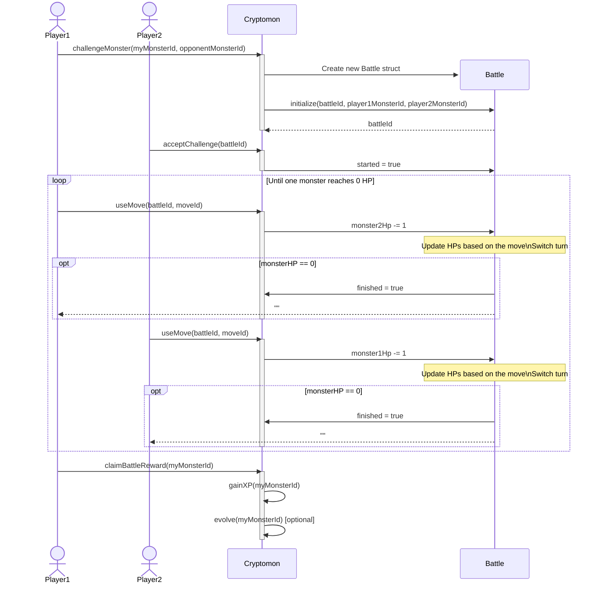
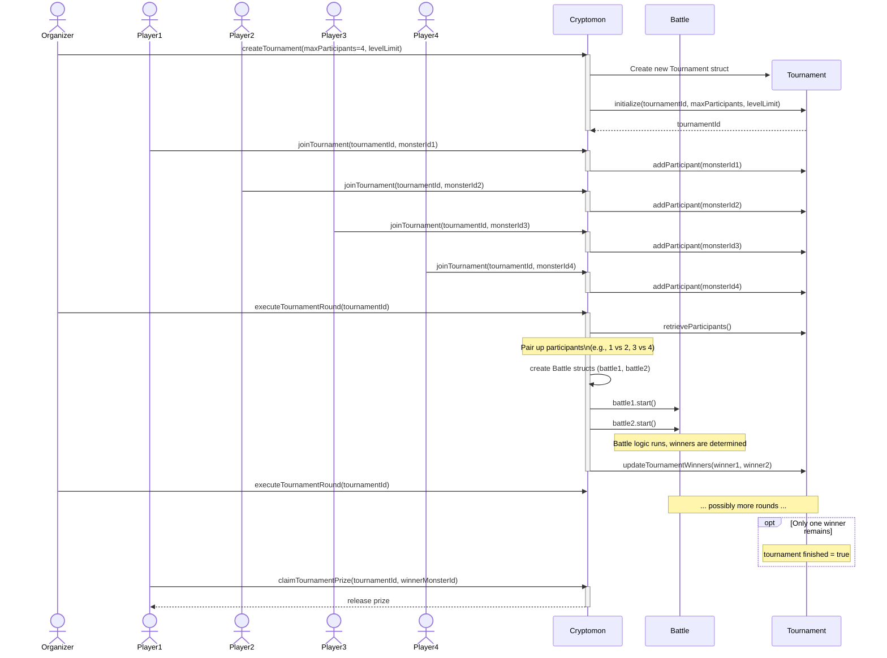

# Cryptómon Game Specification

> [!IMPORTANT]
> Your assignment is only complete if you have all three:
>
> 1. Implementation of the specification below (a skeleton has been prepared for you in [`contracts/`](contracts/)
> 2. Unit tests for the specification below (in [`tests/`](tests/), using Hardhat)
> 3. Documentation of your solution in [`README.md`](README.md)
>
> More information: https://github.com/ftsrg-bta/assignments/wiki

## Overview

Cryptómon is a decentralized blockchain-based game where players collect, trade, and battle unique digital monsters (‘cryptómons’).
Each monster exists as a non-fungible token (NFT) with distinct attributes, abilities, and rarity levels.
Players can participate in battles and tournaments to earn experience points (XP) and rewards for their monsters.

## Technical Requirements

### 1. Monster Ownership
- Each cryptómon must be implemented as a unique non-fungible token (NFT) following the [ERC-721](https://eips.ethereum.org/EIPS/eip-721) standard
- Tokens must represent ownership, attributes, and abilities of each digital creature
- Standard token operations (transfer, approval, etc.) must be supported

### 2. Contract Administration
- The contract must implement the [ERC-173](https://eips.ethereum.org/EIPS/eip-173) standard for ownership
- The designated admin must have exclusive rights to create new monsters
- The ownership shall be transferable as specified in the ERC-173 standard

### 3. Player Challenge System
- Players must be able to challenge others to battles using specific monster IDs
- Challenge validation must include:
  - Verification that the player owns the challenging monster
  - Verification that the opponent monster exists and is owned by another player
- The opponent must explicitly accept challenges before battles commence

### 4. Tournament System
- Implement a single-elimination tournament system where:
  - Players enter their monsters into competition brackets
  - Winners of each round advance to subsequent rounds
  - Tournament continues until only one undefeated monster remains
- Tournament configurations must include:
  - Maximum number of participants
  - Level restrictions for participating monsters
  - Tournament progress tracking

### 5. Battle Mechanics
- Implement a turn-based battle system with the following characteristics:
  - Each monster has a defined set of moves (attack, defend, heal, etc.)
  - Moves affect opponent Health Points (HP) in varying ways
  - Players alternate turns, using one move per turn
  - Battle concludes when one monster's HP reaches zero

## Contract Structure

The main Cryptómon contract must implement the following class structure:

## System Interactions

### Battle Sequence
1. Player1 initiates a challenge by calling `challengeMonster()`
2. Player2 accepts the challenge via `acceptChallenge()`
3. Players alternate turns using `useMove()` until one monster's HP reaches zero
4. Winner calls `claimBattleReward()` to receive XP
5. If sufficient XP is accumulated, monster evolution may occur

### Tournament Sequence
1. Organizer creates tournament with `createTournament()`
2. Players join tournament with `joinTournament()`
3. Organizer executes tournament rounds via `executeTournamentRound()`
4. System automatically pairs participants and creates battles
5. Winners advance to subsequent rounds
6. Final winner claims prize with `claimTournamentPrize()`

## Additional Requirements

> [!IMPORTANT]
> Implementers must also create:
> 
> 1. A reward system that distributes appropriate XP and other incentives
> 2. An evolution system that allows monsters to advance in stages based on XP thresholds

## Additional Tasks

* **Test the smart contract** by writing unit tests
* **Document your solution** in the repository-level [`README.md`](../README.md) file.

## Assignment Owner

| Year | Owner                                                                                          |
|:----:|:----------------------------------------------------------------------------------------------:|
| 2025 | Toldi Balázs Ádám `<balazs.toldi@edu.bme.hu>` [@Bazsalanszky](https://github.com/Bazsalanszky) |
